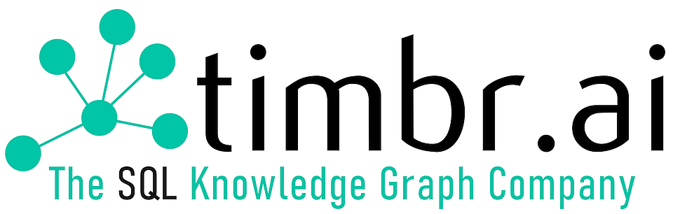

# timbr Python connector sample file
This project is a sample connecting to timbr using Python.

## Dependencies
- Python 3.7.13 +
- Java 8 or Java 11

## Installation
- Install Python: https://www.python.org/downloads/release/python-3713/
- Install Java: https://www.oracle.com/il-en/java/technologies/javase/jdk11-archive-downloads.html
- Run the following command to install the Python dependencies: `pip install -r requirements.txt`  (optional install pandas to run pandas example)
- Download the following jar to `jars` path: https://repo1.maven.org/maven2/org/apache/hive/hive-jdbc/2.3.9/hive-jdbc-2.3.9-standalone.jar

## Sample usage
- For an example of how to use the Python connector for Timbr, follow this [Example file](example.py) 
- For an example of using the Timbr Python connector with Pandas:
  - Make sure you have the pandas library installed, or you can install it by running `pip install pandas`
  - Follow this [Pandas Example File](pandas_example.py)
